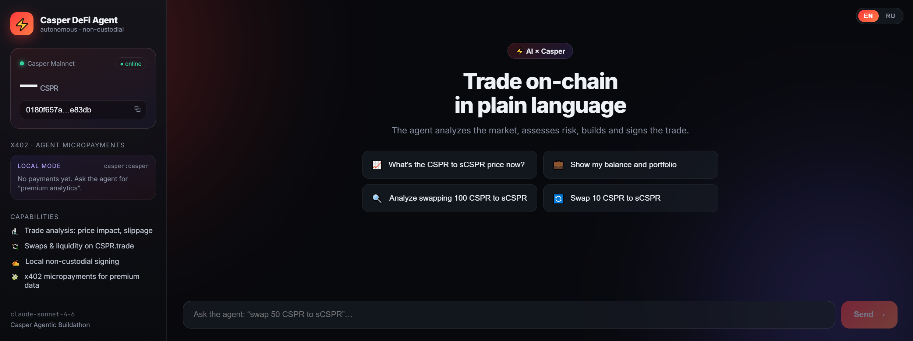
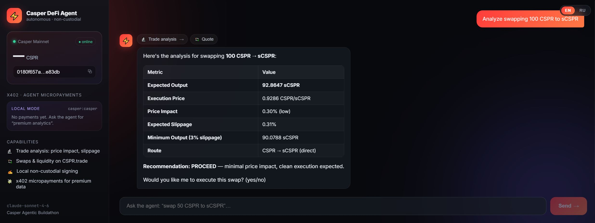

# ⚡ Casper DeFi Agent

> A **non-custodial, conversational AI agent** that trades on the **live CSPR.trade DEX** on **Casper Network** — in plain language.

Built for the [**Casper Agentic Buildathon**](https://dorahacks.io/hackathon/casper-agentic-buildathon) · tracks **DeFi & Payments** + **Agentic AI**.

You talk to the agent like a chat assistant. It analyzes the market, prices the trade
(price impact, slippage), asks for confirmation, **signs the transaction locally** with
your key, and submits it to the network. It can also **autonomously pay for premium data
via x402 micropayments**.



---

## Why it's different

This project covers **all three pillars** of the Casper AI Toolkit in a single product:

| Pillar | This project |
|--------|--------------|
| **MCP** | Connects to the official **CSPR.trade MCP** (`mcp.cspr.trade/mcp`) — 23 live DEX tools |
| **Non-custodial signing** | Signs **Casper 2.0 `TransactionV1`** locally; private key never leaves the host |
| **x402** | Sells a **Token Safety Oracle** to other agents pay-per-call (EIP-712 / secp256k1) over HTTP **+ MCP** |

It runs against **mainnet** through the real DEX, and presents a polished product UI —
not a contract + script proof-of-concept.

---

## Features

- 🗣️ **Natural-language trading** — "swap 50 CSPR to sCSPR", "show my portfolio", "is this trade safe?"
- 🔬 **Pre-trade analysis** — the agent calls `analyze_trade` / `get_quote` and shows price impact & slippage before acting
- ✍️ **Local, non-custodial signing** — `build_swap` → sign `TransactionV1` with the agent's key → `submit_transaction`
- 🛡️ **Token Safety Oracle** — honeypot / sell-tax / liquidity screening of any Casper token, **sold to other agents pay-per-call over x402 + MCP** (and used free in-chat)
- 💸 **x402 agent economy** — the agent both earns (safety checks, analytics) and pays (per-trade fee), with a live spent/earned ledger
- 🎨 **Premium chat UI** — markdown tables, an action **pipeline** of every tool call, wallet card with live CSPR balance, and an x402 payments feed

The agent analyzing a swap — a markdown breakdown plus the live action pipeline of every
tool it called, and the x402 micropayment shown in the sidebar:



---

## Architecture

```
┌─────────────────────────────────────────────┐
│  React UI  (chat · action pipeline · wallet) │
└───────────────────────┬─────────────────────┘
                        │  /api/chat
┌───────────────────────▼─────────────────────┐
│  Node / TypeScript backend                   │
│   • Claude (tool-use loop, Anthropic SDK)    │
│   • MCP client  → CSPR.trade MCP             │  swaps · quotes · liquidity · portfolio
│   • Casper wallet → local TransactionV1 sign │  casper-js-sdk (ed25519 / secp256k1)
│   • x402 client  → EIP-712 micropayments     │  @casper-ecosystem/casper-eip-712
└──────────────────────────────────────────────┘
```

- **`backend/`** — Express server; bridges MCP tools into Claude tool-use, plus local
  signing and the x402 module.
- **`frontend/`** — Vite + React chat with markdown rendering and a tool-call pipeline.

---

## Quickstart

```bash
npm install                              # installs both workspaces
cp backend/.env.example backend/.env     # then add your ANTHROPIC_API_KEY
npm run dev                              # backend :8799 + frontend :5173
```

Open the frontend URL printed by Vite (e.g. http://localhost:5173).

> The agent works **read-only and analysis-only without any funds**. A Casper key and
> a little CSPR are only needed to actually broadcast a swap on mainnet.

### Generate an agent wallet (optional, for real swaps)

```bash
npm run keygen -w backend          # prints public key, account hash, hex key; writes secret_key.pem
```

Paste the printed `CASPER_SECRET_KEY_HEX` (or `CASPER_SECRET_KEY_PEM`) into `backend/.env`
and fund the printed address with a few CSPR for gas.

---

## Environment (`backend/.env`)

| Variable | Purpose |
|----------|---------|
| `ANTHROPIC_API_KEY` | Anthropic API key for the agent |
| `ANTHROPIC_BASE_URL` | Optional API base URL / proxy |
| `AGENT_MODEL` | Claude model (default `claude-sonnet-4-6`) |
| `CSPR_TRADE_MCP_URL` | MCP endpoint (default `https://mcp.cspr.trade/mcp`) |
| `PORT` | Backend port (default `8799`) |
| `CASPER_SECRET_KEY_HEX` / `CASPER_SECRET_KEY_PEM` | Agent signing key (else ephemeral) |
| `CASPER_KEY_ALGO` | `ed25519` (default) or `secp256k1` |
| `X402_FACILITATOR_MODE` | `local` (real crypto verify, no settlement) or `remote` (CSPR.cloud) |
| `X402_*` | x402 network, asset, price, payment key — see `.env.example` |

---

## Non-custodial signing

CSPR.trade MCP returns an **unsigned Casper 2.0 `TransactionV1`**. The backend caches it
server-side under a short `tx_id` (so the ~100 KB transaction never round-trips through the
LLM) and exposes a tool `sign_and_submit(tx_id)`. The agent signs with `casper-js-sdk` and
submits via `submit_transaction`. The private key stays local; the LLM only ever sees a
human-readable summary and the `tx_id`.

Without a configured key the agent runs with an **ephemeral wallet** — signing works, but
the network rejects the transaction (no funds), which is ideal for safe debugging.

---

## x402 — a sellable Token Safety Oracle + agent economy

The flagship x402 product is a **Casper Token Safety Oracle**: a real screening service that
any external AI agent can call **pay-per-use, with no account**, over both HTTP and **MCP**.

**What the check does** (from live CSPR.trade data):
- **Honeypot / sell-tax** — quotes CSPR→token and token→CSPR round-trip; low retention or an
  un-sellable token is flagged
- **Liquidity** — price impact on a fixed-size trade
- Returns a **risk score + `SAFE / CAUTION / DANGER`** with factors

Our own agent uses the oracle **for free** inside the chat (tool `check_token_safety`);
**external** agents pay for it via x402. All payments land in a live **Spent / Earned ledger**.

| Flow | Direction | What happens |
|------|-----------|--------------|
| **Token Safety Oracle** | 💰 earn | External agents pay us per token check via x402 (HTTP + MCP) |
| **Sell analytics** | 💰 earn | External agents pay for premium market analytics (`/api/premium/intel`) |
| **Per-trade fee** | 💸 spend | Each executed swap pays a small service fee to the treasury |

Each payment is a real signed authorization (Casper **`exact`** scheme):

```
402 Payment Required + PaymentRequirements
   → sign TransferAuthorization (EIP-712 / secp256k1)
   → PAYMENT-SIGNATURE header (or x_payment arg over MCP)
   → facilitator verify + settle
   → 200 + resource
```

### Sell it over MCP

A standalone MCP server exposes the paid `check_token_safety` tool so any MCP client
(Claude Desktop, Cursor, another agent) can discover and call it:

```bash
npm run mcp -w backend          # stdio MCP server: check_token_safety
npm run mcp:demo -w backend     # external buyer agent: 402 → pay (x402) → safety report
```

Claude Desktop config:

```json
{ "mcpServers": { "casper-token-safety": {
  "command": "npm", "args": ["run", "mcp", "-w", "backend"] } } }
```

Implemented in `backend/src/`:

- `safety/oracle.ts` — the token safety check (honeypot + liquidity)
- `safety-mcp.ts` — standalone x402-paid MCP server · `safety-mcp-demo.ts` — buyer-agent demo
- `x402/` — `wallet` (secp256k1), `client` (EIP-712 sign), `facilitator` (**local** crypto-verify /
  **remote** CSPR.cloud), `service` (resource catalog + spend/earn ledger)
- protected routes `GET /api/safety/check`, `GET /api/premium/intel`, demo `POST /api/x402/demo-sale`

`local` mode produces **real EIP-712/secp256k1 signatures** with full crypto verification;
on-chain settlement is gated behind `remote` mode (CSPR.cloud facilitator token + CEP-18
balance), switchable via `.env` with no code changes.

---

## Project structure

```
backend/
  src/
    index.ts          REST API (/api/chat, /api/health, /api/wallet, /api/x402, /api/premium/intel)
    agent.ts          Claude tool-use loop + MCP bridge + local tools
    mcpClient.ts      CSPR.trade MCP client
    wallet.ts         Casper TransactionV1 signing wallet
    deployUtils.ts    MCP-output / unsigned-tx helpers
    x402/             wallet · client · facilitator · service · types
    safety/oracle.ts  Token Safety Oracle (honeypot + liquidity checks)
    safety-mcp.ts     standalone x402-paid MCP server (check_token_safety)
    safety-mcp-demo.ts  external buyer-agent demo (402 → pay → report)
  scripts/keygen.ts   Casper keypair generator
frontend/
  src/App.tsx         chat UI, action pipeline, wallet card, x402 feed
```

---

## Tech stack

TypeScript · Node + Express · React + Vite · [Anthropic SDK](https://docs.anthropic.com) (Claude) ·
[`@modelcontextprotocol/sdk`](https://github.com/modelcontextprotocol) ·
[`casper-js-sdk`](https://github.com/casper-ecosystem/casper-js-sdk) ·
[`@casper-ecosystem/casper-eip-712`](https://github.com/casper-ecosystem/casper-eip-712)

## Casper AI Toolkit references

- CSPR.trade MCP — https://mcp.cspr.trade
- Casper MCP Server — https://github.com/msanlisavas/casper-mcp
- x402 for Casper — https://github.com/make-software/casper-x402 · [Facilitator API](https://docs.cspr.cloud/x402-facilitator-api/reference)
- CSPR.click Agent Skill — https://docs.cspr.click/documentation/ai-agent-skills
- Casper AI Toolkit — https://www.casper.network/ai

---

## Disclaimer

Experimental hackathon software. Runs against Casper **mainnet** via CSPR.trade — real funds
are at stake when a signing key is configured and funded. Never commit `.env` or key files
(`*.pem`); they are git-ignored. Use a low-balance wallet for demos.
